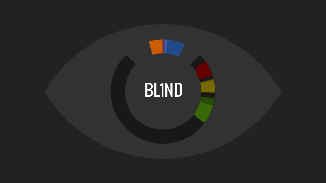
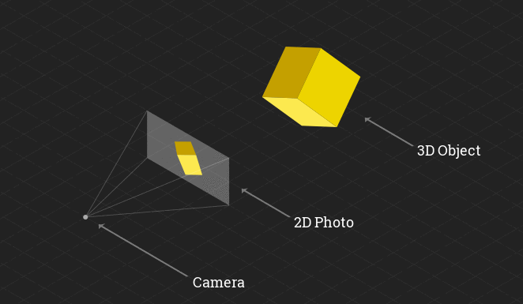
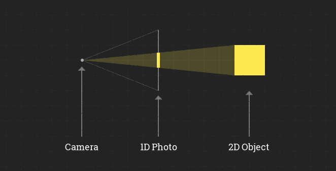
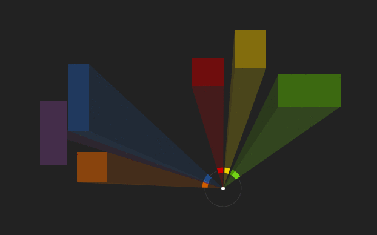

# BL1ND

This is an experimental 1D game made in 48 hours for Ludum Dare 28.  It won
first place in the innovation category.

__[PLAY](http://shaunew.github.io/bl1nd-ld28) | [Contest Entry](http://www.ludumdare.com/compo/ludum-dare-28/?action=preview&uid=31638)__

## Explanation

Everyone knows that a photograph is a 2D image of a 3D world. Take this
spinning cube for example:

When the colors of light travel from the object to the camera, they pass
through and mark the photo, creating the colored pixels of the image. You can
imagine the same scenario from a top-down perspective. Incidentally, this is
the same as imagining a 1D image of a 2D object.

You can imagine a cylinder-shaped photo as a means to capture a panorama in a
circle, again shown in a top-down illustration, but with more objects.

This is the basis of my 1D game entry BL1ND.

## Goal

My intention is to make an experiment to see if a person can interpret a 2D
world with just a 1D image, in a similar way that we can interpret a 3D world
with a 2D image.

I also want to wrap it in an emotionally compelling environment with a dark
atmosphere and emotional story to heighten the gravity and challenge of
blindness.

## Code

This game runs on HTML5 Canvas.  It is made from scratch in plain javascript, with
boiler-plate code ripped from my Pterodactyl Attack engine that you can read about at
__<http://pteroattack.com>__.

The game also includes the quick map editor I made for the game.  (mapper.html)

## Future

You can follow the development of the full version at <http://github.com/shaunew/bl1nd>.
