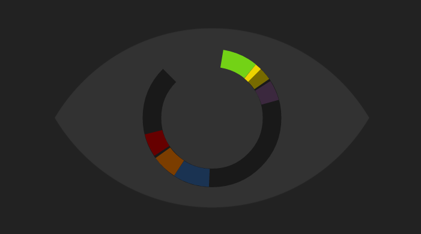

# bl1nd

This is an experimental 1D game made in 48 hours for Ludum Dare 28.

[>> PLAY HERE](http://shaunew.github.io/)

[>> LUDUM DARE ENTRY](http://www.ludumdare.com/compo/ludum-dare-28/?action=preview&uid=31638)

## Goal

My intention is to make an experiment to see if a person can interpret a 2D
world with just a 1D image, in a similar way that we can interpret a 3D world
with a 2D image.

I also want to wrap it in an emotionally compelling environment with a dark
atmosphere and emotional story to heighten the gravity and challenge of
blindness.

## Code

This game runs on HTML5 Canvas.  It is made from scratch in plain javascript, with
boiler-plate code ripped from my Pterodactyl Attack engine that you can read about at
__<http://hygoon.com>__.

The game also includes the quick map editor I made for the game.  (mapper.html)
